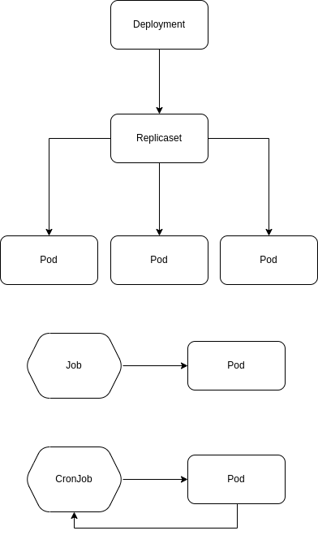

# Kubernetes - FASTAPI Microservice/API + Mongo

## Setup Instructions

### Pre-reqs

- Docker and Local Kubernetes Installation
https://ubuntu.com/tutorials/install-a-local-kubernetes-with-microk8s?&_ga=2.95357212.1448209.1665159994-1843409535.1663600026#1-overview


### Run locally (development)

```
make job-run
```


## Build and push container image

```
make image-build
```

## K8s Job execution

A very common issue is the developer using a naked pod for recurring processes, but kubernetes already has a very useful cronjob feature to accomplish this task.



The K8s replicaset will manage the number of replicas of the pods in the cluster.
The deployment will manage the version of the application.
The pods will run the application.

The `deployment` is a good solution for a perennial application which runs continuously in the cluster. An API is a good example of this kind of application.

```
kubectl apply -f manifests/deployment.yaml
kubectl get pods
kubectl delete -f manifests/deployment.yaml
```

To execute routines with a start and end, the `job` is a better solution for running a batch process once.

```
kubectl apply -f manifests/job.yaml
kubectl get job
# watching multiple executions
watch 'kubectl get pod'
kubectl describe job job
kubectl get pods
kubectl logs <name of the pod, for example job-zl2m8>
kubectl delete -f manifests/job.yaml
```

Cronjob:

Go to https://crontab.guru/ or http://crontab-generator.org and set your crontab schedule. We'll use the `*/3 * * * *` to create the job at every 3rd minute.

```
kubectl apply -f manifests/cronjob.yaml
kubectl get cronjob
watch 'kubectl get cronjob'
watch 'kubectl get job'
kubectl delete -f manifests/cronjob.yaml
```
